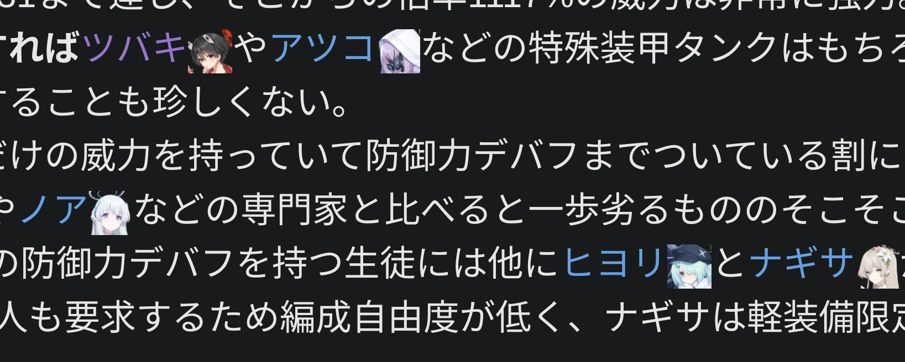

Daisy AddCharaIcon - notation game characters
----
In page append notation with game characters.  
ページ内のゲーム登場人物名の横に顔アイコンを付与します。  

  

# Get AddCharaIcon for webextension
[Firefox Add-ons](https://addons.mozilla.org/ja/firefox/addon/daisy-addcharaicon/)  
[Chrome WebStore](https://chromewebstore.google.com/detail/daisy-addcharaicon/pgknndjpopofcdekhleekobmgkbphepm)  

# Build
Build env is Ubuntu.  

setup:  
`npm install`  
package:  
`npm run release`  
source:
`npm run archive-src`  

# License
Page replace: Mozilla Public License2.0  
Other: Clause-2 BSD License  
本拡張機能は非公式のものです  

# 主な機能
- ブルーアーカイブの生徒に対応
- アイコン画像のキャッシュ

# TODO
- 拡張機能のON/OFF切り替え
- リンク以外の文中の人物名に対応(字句解析)
- 表記ブレ・略称・通称等対応 ("シロコ（水着）":"水着シロコ","カジコ")
- アイコン辞書データの編集または追加機能
- アークナイツのオペレータに対応する?

# Contact
mail: [michinari.nukazawa@gmail.com][mailto]  
twitter: [@MNukazawa][twitter]  

Develop by Michinari.Nukazawa, in project "[daisy bell][pixiv_booth_project_daisy_bell]".  

[pixiv_booth_project_daisy_bell]: https://daisy-bell.booth.pm/
[mailto]: mailto:michinari.nukazawa@gmail.com
[twitter]: https://twitter.com/MNukazawa
